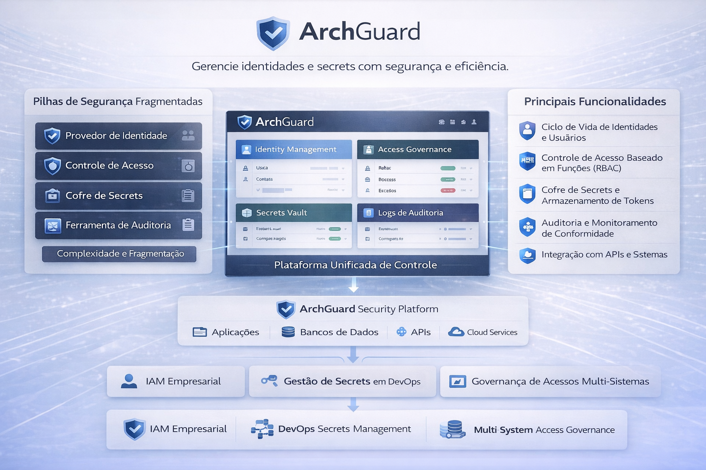

# ArchGuard

**Console de Gerenciamento de Identidades, Acessos e Secrets**

ArchGuard é uma plataforma administrativa web que unifica o gerenciamento de identidades (IAM) e cofre de senhas em uma interface moderna e intuitiva. O projeto resolve a complexidade de administrar sistemas de identidade descentralizados, oferecendo uma camada de gestão visual sobre engines open-source robustos.



---

## O Problema

Organizações que adotam soluções open-source de identidade como o Kanidm enfrentam desafios operacionais significativos:

- **Administração via CLI/API** — gerenciar centenas de identidades, grupos e integrações OAuth2 via linha de comando é ineficiente e propenso a erros
- **Fragmentação de ferramentas** — identidades num lugar, cofre de senhas em outro, auditoria em outro
- **Curva de aprendizado elevada** — equipes de suporte precisam conhecer a API REST do Kanidm para operações básicas como reset de credenciais
- **Falta de visibilidade** — sem dashboards ou relatórios consolidados sobre o estado das identidades

## A Solução

ArchGuard Console oferece uma interface web completa que abstrai a complexidade dos engines subjacentes:

- **Gestão de Identidades** — CRUD completo de pessoas, com wizard de criação, importação CSV em lote e gerenciamento de credenciais (senha, TOTP, WebAuthn, Passkeys)
- **Grupos e RBAC** — criação e administração de grupos com visualização hierárquica, atribuição em massa de membros
- **OAuth2 / SSO** — configuração visual de clientes OAuth2 (Basic e Public/PKCE), scope maps, claim maps e snippets de integração prontos para React, Spring Boot, Node.js, Python e Flutter
- **Service Accounts** — gestão de contas de serviço para integrações M2M com geração e revogação de API tokens
- **Cofre de Senhas** — integração com AliasVault para gerenciamento centralizado de secrets
- **Auditoria** — log de eventos com filtros temporais, exportação CSV/JSON
- **Multi-tenant** — suporte a múltiplos tenants com isolamento de permissões via RBAC (Super Admin, Tenant Admin, Service Desk, Viewer)

---

## Arquitetura

```
┌─────────────────────────────────────────────┐
│           ArchGuard Console                 │
│          (TanStack Start)                   │
│                                             │
│  ┌────────────┐  ┌───────────────────────┐  │
│  │ Server Fns │  │  Client Components    │  │
│  │ (session,  │  │ (React + TanStack Q.) │  │
│  │  OIDC cb,  │  │                       │  │
│  │  API proxy)│  │                       │  │
│  └─────┬──────┘  └──────────┬────────────┘  │
└────────┼────────────────────┼───────────────┘
         │                    │
    ┌────┴─────┐        ┌────┴─────┐
    │ Kanidm   │        │ Kanidm   │
    │ Auth API │        │ Admin API│
    │ (OIDC)   │        │ (REST)   │
    └──────────┘        └──────────┘
         │
    ┌────┴──────┐
    │ AliasVault│
    │    API    │
    └───────────┘
```

**Dual session:** O console mantém duas sessões — uma OIDC para identidade do operador e uma service account para chamadas administrativas à API do Kanidm. Os tokens sensíveis nunca são expostos ao browser; todo acesso à API administrativa passa por um proxy server-side com validação de path e autenticação.

---

## Tech Stack

| Camada | Tecnologia | Papel |
|---|---|---|
| Framework | [TanStack Start](https://tanstack.com/start) | Full-stack, file-based routing, server functions |
| Router | [TanStack Router](https://tanstack.com/router) | Type-safe routing, beforeLoad guards |
| Data | [TanStack Query v5](https://tanstack.com/query) | Cache, mutations, optimistic updates |
| Forms | [TanStack Form](https://tanstack.com/form) | Type-safe forms com validação Zod |
| Tables | [TanStack Table v8](https://tanstack.com/table) | Sorting, filtering, pagination |
| UI | [Shadcn/ui](https://ui.shadcn.com) | Componentes acessíveis e composáveis |
| Styling | [Tailwind CSS v4](https://tailwindcss.com) | Utility-first CSS |
| Auth | [oidc-client-ts](https://github.com/authts/oidc-client-ts) | OIDC Authorization Code + PKCE S256 |
| Validação | [Zod](https://zod.dev) | Schema validation, inferência de tipos |
| i18n | [i18next](https://www.i18next.com) | PT-BR (padrão) e EN |
| Icons | [Lucide React](https://lucide.dev) | Ícones consistentes com Shadcn |
| Build | [Vite](https://vite.dev) | HMR, tree-shaking, bundling |
| Testes | [Vitest](https://vitest.dev) + [Testing Library](https://testing-library.com) | Unit + Integration |

---

## Projetos Utilizados (Backend Engines)

ArchGuard Console é uma camada de gestão sobre projetos open-source independentes:

### Kanidm

> **Identity Management Server** — [github.com/kanidm/kanidm](https://github.com/kanidm/kanidm)

Kanidm é um servidor de identidade moderno escrito em Rust, projetado como alternativa a FreeIPA e LDAP. Fornece:
- Autenticação OIDC/OAuth2 com PKCE
- Gerenciamento de identidades via API REST (`/v1/`)
- Suporte nativo a Passkeys, WebAuthn, TOTP
- Grupos, RBAC e políticas de acesso
- Service Accounts com API tokens

ArchGuard Console utiliza o Kanidm como **engine de identidade**, consumindo sua API administrativa para todas as operações de CRUD de pessoas, grupos, OAuth2 clients e service accounts.

### AliasVault

> **Password & Secrets Vault** — [github.com/lanedirt/AliasVault](https://github.com/lanedirt/AliasVault)

AliasVault é um cofre de senhas open-source com criptografia end-to-end. ArchGuard Console integra com o AliasVault para:
- Dashboard de status do vault
- Monitoramento de SMTP
- Gerenciamento centralizado de secrets da organização

---

## Pré-requisitos

- **Node.js** >= 20
- **Docker** (ou OrbStack/Podman) — para os containers Kanidm e AliasVault
- **expect** — para o script de setup (`brew install expect` no macOS)

## Quick Start (Desenvolvimento Local)

1. Clone o repositório:
```bash
git clone git@github.com:edsonmartins/archguard.git
cd archguard
```

2. Suba os containers backend:
```bash
docker compose up -d
```

3. Inicialize o Kanidm (grupos, usuários, OAuth2, service account):
```bash
./scripts/setup-kanidm.sh
```

4. Instale as dependências e inicie o Console:
```bash
cd archguard-console
npm install
npm run dev
```

5. Acesse `http://localhost:3000` e faça login com um dos usuários de teste:

| Usuário | Senha | Papel |
|---|---|---|
| `testadmin` | `TestAdmin123!` | Super Admin |
| `testuser` | `TestUser123!` | Viewer |

> **Nota:** Como o Kanidm usa TLS com certificado auto-assinado, aceite o certificado no browser visitando `https://localhost:8443` antes de fazer login.

## Variáveis de Ambiente

```env
ARCHGUARD_ID_URL=https://localhost:8443          # URL do Kanidm
ARCHGUARD_SA_TOKEN=<token>                       # Service account token (gerado pelo setup)
ARCHGUARD_VAULT_URL=http://localhost:8080         # URL do AliasVault
VITE_ARCHGUARD_ID_URL=https://localhost:8443     # URL do Kanidm (client-side)
SESSION_SECRET=<64-char-hex>                     # Chave AES-256-GCM para sessão
```

## Build para Produção

```bash
cd archguard-console
npm run build
node .output/server/index.mjs
```

---

## Estrutura do Projeto

```
archguard/
├── archguard-console/           # Frontend (TanStack Start)
│   ├── src/
│   │   ├── routes/              # File-based routing
│   │   │   ├── _authed/         # Rotas protegidas
│   │   │   │   ├── dashboard.tsx
│   │   │   │   ├── identities/  # CRUD de pessoas
│   │   │   │   ├── groups/      # CRUD de grupos
│   │   │   │   ├── oauth2/      # Gestão OAuth2/SSO
│   │   │   │   ├── service-accounts/
│   │   │   │   ├── audit.tsx
│   │   │   │   ├── vault.tsx
│   │   │   │   └── settings/
│   │   │   ├── login.tsx
│   │   │   ├── callback.tsx     # OIDC callback
│   │   │   └── __root.tsx
│   │   ├── server/              # Server functions (Nitro)
│   │   │   ├── auth.ts          # Sessão, login, logout
│   │   │   ├── kanidm-proxy.ts  # Proxy seguro (anti-SSRF)
│   │   │   └── session.ts       # Criptografia AES-256-GCM
│   │   ├── components/          # Componentes React
│   │   └── lib/                 # API client, hooks, i18n, utils
│   └── documentos/              # Especificação e ADRs
├── docker-compose.yml           # Kanidm + AliasVault
├── kanidm/server.toml           # Configuração do Kanidm
├── scripts/setup-kanidm.sh      # Inicialização automatizada
└── images/                      # Recursos visuais
```

---

## Segurança

- **PKCE S256** para fluxo OIDC (proteção contra interceptação de authorization code)
- **Proxy server-side** para API Kanidm — o SA token nunca é exposto ao browser
- **Validação de path (anti-SSRF)** — whitelist de endpoints permitidos no proxy
- **Sessão criptografada** — cookies httpOnly com AES-256-GCM
- **RBAC granular** — 27 permissões derivadas dos grupos OIDC
- **Separação de privilégios** — Kanidm enforces separation of duties entre admin e idm_admin por design

---

## Licença

Este projeto é software proprietário. Todos os direitos reservados.

Os engines utilizados (Kanidm e AliasVault) possuem suas próprias licenças open-source — consulte seus respectivos repositórios.

---

## Créditos

- [Kanidm](https://github.com/kanidm/kanidm) — Identity Management Server (MPL-2.0)
- [AliasVault](https://github.com/lanedirt/AliasVault) — Password & Secrets Vault (MIT)
- [TanStack](https://github.com/TanStack) — Router, Query, Form, Table, Start (MIT)
- [Shadcn/ui](https://github.com/shadcn-ui/ui) — UI Components (MIT)
- [Tailwind CSS](https://github.com/tailwindlabs/tailwindcss) — Utility-first CSS (MIT)
- [oidc-client-ts](https://github.com/authts/oidc-client-ts) — OIDC Client Library (Apache-2.0)
- [Lucide](https://github.com/lucide-icons/lucide) — Icon Library (ISC)
- [Zod](https://github.com/colinhacks/zod) — Schema Validation (MIT)
- [Vite](https://github.com/vitejs/vite) — Build Tool (MIT)

Desenvolvido com o auxílio de [Claude Code](https://claude.ai/claude-code) (Anthropic).
